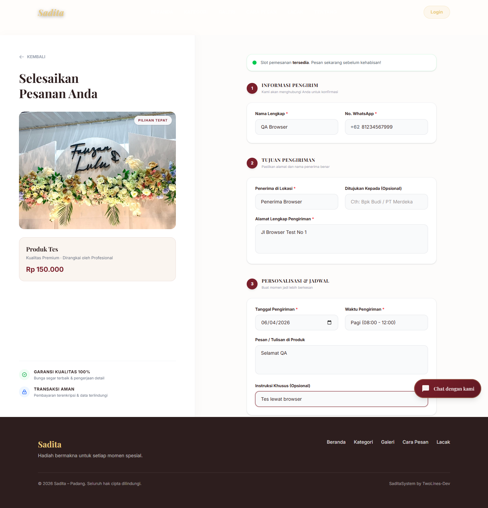
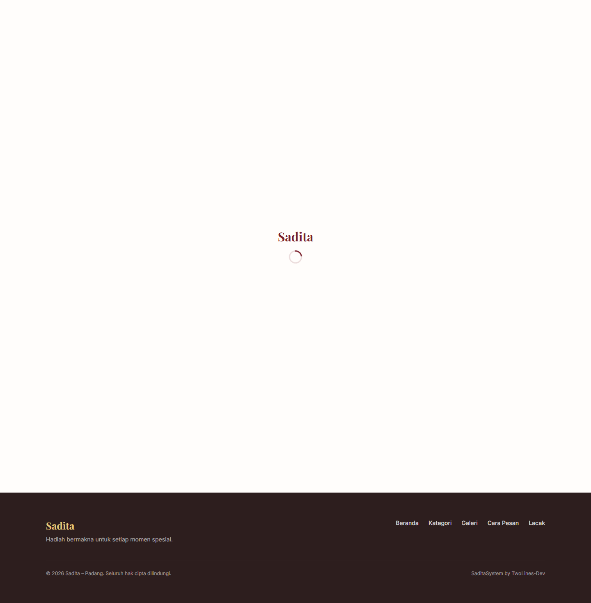

# SaditaSystem

SaditaSystem adalah sistem informasi manajemen bisnis untuk **Sadita Decoration**. Aplikasi ini dipakai untuk mengelola layanan **sewa**, **jasa dekorasi**, dan **hantaran**, dengan alur utama:

`request order -> review admin -> finalisasi harga -> pembayaran -> proses -> selesai`

Project ini dibangun dengan Laravel untuk backend, Filament untuk admin panel, dan Vite + Tailwind CSS untuk frontend publik.

## Tim Pengembang

- Bagatio Putra Joandri - Project Manager dan AI Specialist
- Ahsan Ramadan - Lead Programmer
- Jeli Mayora - System Analyst
- Aprilla Maulida - Quality Assurance

## Stack Utama

- PHP `^8.3`
- Laravel `^13.0`
- Filament `^5.6`
- MySQL / MariaDB
- Vite `^8.0.0`
- Tailwind CSS `^4.0.0`

## Dependency Project

### Backend

- `laravel/framework` `^13.0`
- `filament/filament` `^5.6`
- `laravel/tinker` `^3.0`
- `midtrans/midtrans-php` `^2.6`
- `simplesoftwareio/simple-qrcode` `^4.2`

### Development Backend

- `fakerphp/faker` `^1.23`
- `laravel/pail` `^1.2.5`
- `laravel/pint` `^1.27`
- `mockery/mockery` `^1.6`
- `nunomaduro/collision` `^8.6`
- `phpunit/phpunit` `^12.5.12`

### Frontend / Tooling

- `vite` `^8.0.0`
- `laravel-vite-plugin` `^3.0.0`
- `tailwindcss` `^4.0.0`
- `@tailwindcss/vite` `^4.0.0`
- `concurrently` `^9.0.1`
- `prettier` `^3.8.3`
- `prettier-plugin-blade` `^3.1.4`

## Fitur Inti

### Public Website

- landing page Sadita Decoration
- form pemesanan tanpa login
- halaman invoice pesanan
- API tracking pesanan berbasis kode order

### Admin Panel

- login admin
- kelola kategori
- kelola produk
- kelola pelanggan
- kelola pesanan
- kelola pembayaran
- kelola ulasan
- dashboard widget Filament

## Struktur Folder Singkat

```text
SaditaSystem/
|-- app/
|   |-- Filament/
|   |-- Http/Controllers/
|   |-- Models/
|   |-- Observers/
|   `-- Services/
|-- database/
|   |-- migrations/
|   `-- seeders/
|-- docs/
|   |-- md/
|   |-- pdf/
|   |-- pic/
|   |-- txt/
|   `-- Word/
|-- public/
|-- resources/
|-- routes/
|-- tests/
|-- .github/workflows/
|-- composer.json
|-- package.json
`-- nixpacks.toml
```

## Cara Menjalankan Singkat

```bash
composer install
npm install
copy .env.example .env
php artisan key:generate
php artisan migrate
php artisan serve
npm run dev
```

Untuk panduan instalasi lengkap, lihat:

- [installation doc](./docs/md/installation-doc.md)

## Akun Demo

Seeder default membuat akun admin demo:

- username / email: `admin`
- password: `admin`

Catatan: akun ini hanya untuk development lokal. Ganti untuk environment lain.

## Dokumentasi Pendukung

- [installation doc](./docs/md/installation-doc.md)
- [feature doc](./docs/md/feature-doc.md)
- [changelog](./docs/md/changelog.md)
- [dependency doc](./docs/md/dependency-doc.md)
- [refactoring doc](./docs/md/refactoring-doc.md)
- [github action doc](./docs/md/github-action-doc.md)
- [performance doc](./docs/md/performance-doc.md)

## Screenshot Project

### Form Order



### Invoice Pesanan



## Catatan Pengembangan

- database utama untuk perilaku lokal dan production adalah MySQL / MariaDB
- default session dan cache yang direkomendasikan untuk tim adalah `database`
- pelanggan tidak diwajibkan login
- scope project tidak mencakup florist / buket
- tracking pesanan masih dikembangkan bertahap setelah create-order flow stabil
- untuk optimasi lokal admin panel, jalankan `composer run optimize-local`
- `context7` tidak mengikat otomatis ke semua dependency, tetapi siap dipakai on-demand untuk dokumentasi library/framework seperti Laravel, Filament, Tailwind, dan Vite saat dibutuhkan

## Deployment

Deploy production saat ini diarahkan ke Railway dengan konfigurasi utama di:

- `nixpacks.toml`

## Lisensi

Project ini mengikuti lisensi MIT bawaan Laravel, kecuali ada penyesuaian lebih lanjut dari tim pengembang.
