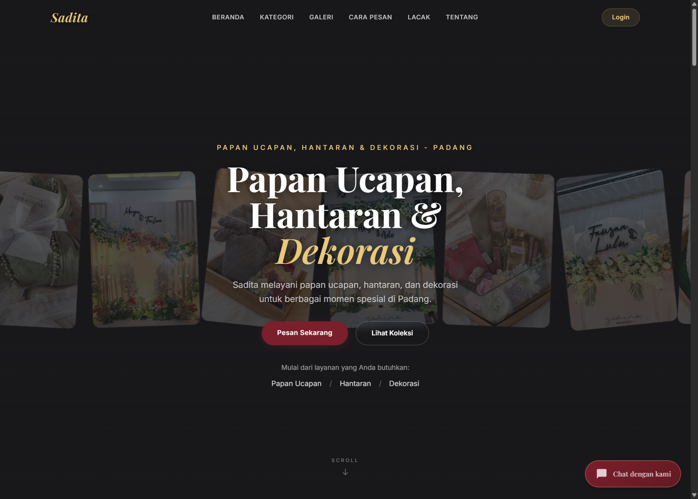

# SaditaSystem

SaditaSystem adalah sistem informasi manajemen bisnis untuk **Sadita Decoration** yang difokuskan pada layanan **papan ucapan**, **hantaran**, dan **dekorasi**. Project ini dibangun untuk mendukung alur bisnis:

`request order -> review admin -> finalisasi harga -> pembayaran -> proses -> selesai`

Project ini menggunakan Laravel untuk backend, Filament untuk admin panel, serta Vite + Tailwind CSS untuk frontend publik.

## Tim Pengembang

- `Bagatio Putra Joandri` - `2411081005` - Project Manager & AI Specialist
- `Ahsan Ramadan` - `2411081002` - Lead Programmer
- `Jeli Mayora` - `2411081012` - System Analyst
- `Aprilla Maulida` - `211083002` - Quality Assurance

## Ruang Lingkup Project

- public website untuk landing page dan form pemesanan tanpa login
- admin panel untuk operasional internal
- pengelolaan kategori, produk, pelanggan, pesanan, dan pembayaran
- alur pembayaran yang saat ini terintegrasi dengan DOKU
- tracking pesanan yang dikembangkan bertahap

Catatan penting:

- project ini **tidak** ditujukan untuk florist / buket bunga
- pelanggan **tidak diwajibkan login**
- database utama local development dan production adalah **MySQL / MariaDB**

## Stack Utama

- PHP `^8.3`
- Laravel `^13.0`
- Filament `^5.6`
- MySQL / MariaDB
- Vite `^8.0.0`
- Tailwind CSS `^4.0.0`

## Fitur Inti

### Public Website

- landing page Sadita Decoration
- katalog layanan berdasarkan kategori
- form pemesanan tanpa login
- halaman invoice pesanan
- pelacakan pesanan berbasis kode order

### Admin Panel

- login admin
- dashboard operasional
- kelola kategori
- kelola produk
- kelola pelanggan
- kelola pesanan
- kelola pembayaran
- kelola ulasan

## Struktur Folder Singkat

```text
SaditaSystem/
|-- app/
|   |-- Filament/
|   |-- Http/Controllers/
|   |-- Models/
|   |-- Observers/
|   `-- Services/
|-- database/
|   |-- migrations/
|   `-- seeders/
|-- docs/
|   |-- md/
|   `-- pic/
|-- public/
|-- resources/
|-- routes/
|-- tests/
|-- .github/workflows/
|-- composer.json
|-- package.json
`-- nixpacks.toml
```

## Cara Menjalankan Singkat

### Opsi cepat

```bash
composer run setup
composer run dev
```

### Opsi manual

```bash
composer install
npm install
copy .env.example .env
php artisan key:generate
php artisan migrate
php artisan serve
npm run dev
```

Untuk panduan instalasi yang lebih lengkap, lihat:

- [installation doc](./docs/md/installation-doc.md)

## Verifikasi Lokal Cepat

Untuk mengecek kesehatan admin panel custom, auth, cache, dan smoke test dengan satu command di Windows:

```powershell
powershell -ExecutionPolicy Bypass -File .\scripts\verify-local.ps1
```

Kalau Anda hanya ingin cek PHP/Laravel tanpa E2E Playwright:

```powershell
powershell -ExecutionPolicy Bypass -File .\scripts\verify-local.ps1 -SkipE2E
```

Catatan:

- script akan membersihkan cache config/view lalu menjalankan test `AuthFlow`, `AdminRoleAccess`, `AdminUserManagementFlow`, dan `AdminPanelSmoke`
- bila `node_modules` belum tersedia, bagian Playwright otomatis dilewati
- untuk skenario hapus user owner-only, set env `E2E_DELETE_USER_ID` lebih dulu; jika tidak, test itu akan otomatis `skip`

## Akun Demo Admin

Seeder default membuat akun admin demo:

- username / email: `admin`
- password: `admin`

## Dokumentasi Pendukung

- [installation doc](./docs/md/installation-doc.md)
- [feature doc](./docs/md/feature-doc.md)
- [changelog](./docs/md/changelog.md)
- [dependency doc](./docs/md/dependency-doc.md)
- [refactoring doc](./docs/md/refactoring-doc.md)
- [github action doc](./docs/md/github-action-doc.md)
- [performance doc](./docs/md/performance-doc.md)

## Tampilan Awal Web



## Deployment

Deploy production saat ini diarahkan ke Railway dengan konfigurasi utama di:

- `nixpacks.toml`

## Technical Summary

SaditaSystem telah melalui rangkaian finalisasi yang mencakup penguatan keamanan, optimasi performa, perapihan arsitektur admin, modernisasi quality assurance, dan penyempurnaan pengalaman pengguna pada panel admin custom `/admin-lite`.

### 1. Penguatan Keamanan

Pada tahap audit keamanan, isu F-01 dan F-03 difokuskan pada kontrol akses dan validasi autentikasi admin. Solusi yang diterapkan adalah pembuatan middleware `CheckRole` untuk memastikan hanya role yang berhak yang dapat mengakses grup route admin. Middleware ini kemudian dipasang pada route admin di `routes/web.php`, sehingga akses ke panel tidak lagi hanya bergantung pada login, tetapi juga pada otorisasi role yang eksplisit.

Di sisi autentikasi, `AuthController` diperketat agar login admin tidak hanya memeriksa kredensial, tetapi juga memvalidasi status `is_admin`. Dengan perubahan ini, user biasa yang valid di database tetap tidak dapat masuk ke area administrasi apabila tidak memiliki hak admin. Langkah ini menutup celah akses horizontal yang sebelumnya berpotensi muncul.

### 2. Optimasi Performa Dashboard dan Modul Admin

Audit performa mengidentifikasi beban berat pada proses penyusunan snapshot dashboard, terutama karena banyaknya query agregat yang dipanggil secara terpisah. Refactor pada `AdminController@buildAdminSnapshot` dilakukan dengan pendekatan agregasi yang lebih efisien dan caching per modul. Hasilnya, perhitungan statistik tidak lagi membebani setiap request secara penuh, dan proses rendering dashboard menjadi jauh lebih ringan serta lebih siap untuk skala data yang lebih besar.

Selain itu, payload analytics kini dipisahkan dari halaman manajemen data. Halaman `manage` tidak lagi membawa data grafik atau analitik yang sebenarnya hanya relevan untuk dashboard overview. Pemisahan ini menurunkan beban request, mengurangi kompleksitas view, dan membuat halaman tabel lebih fokus pada tugas operasional.

Pada area form, `buildFormOptions` juga dioptimalkan agar tidak memuat seluruh data relasi sekaligus. Dropdown seperti kategori, produk, pelanggan, dan pesanan kini disiapkan dengan pendekatan limit atau lazy option set, sehingga halaman Tambah/Edit tetap responsif walaupun jumlah data master bertambah besar.

### 3. Konsistensi Cache dan Akurasi Data

Agar data dashboard tetap akurat setelah mutasi, mekanisme `flushAdminCaches()` telah dipastikan dipanggil pada operasi yang mengubah data seperti `store`, `update`, dan `delete`. Dengan pola ini, cache tetap memberi keuntungan performa tanpa menimbulkan risiko data snapshot yang stale atau tidak sinkron dengan kondisi database terbaru.

### 4. Penyelarasan UI/UX Admin

Dari sisi UX, tampilan admin difokuskan agar lebih mencerminkan karakter produk Sadita dan menghindari pola antarmuka yang terasa generik atau “AI-like”. Struktur nested card yang berlebihan dikurangi, hierarki visual diperjelas, dan halaman manage disusun agar metrik utama muncul di atas sementara tabel kerja berada tepat di bawahnya.

Identitas visual “SaditaSystem” juga disesuaikan agar lebih simetris dan selaras dengan gaya tipografi Sadita. Navigasi antar modul dirapikan, link “Back” dan “Batal” diarahkan konsisten ke route custom `/admin-lite`, dan transisi halus ditambahkan agar perpindahan halaman terasa lebih premium dan app-like tanpa mengganggu performa.

Pada tahap final, form Tambah/Edit juga ditingkatkan dari sisi interaksi. Tombol submit kini menampilkan state `Loading...` saat diproses untuk mencegah klik berulang. Selain itu, pesan validasi Laravel kini tampil konsisten di setiap field yang bermasalah, sehingga feedback error lebih jelas, lebih dekat ke sumber masalah, dan lebih mudah dipahami user admin.

### 5. Modernisasi QA dan Test Alignment

Lapisan QA diperbarui agar sesuai dengan arsitektur terbaru. Konfigurasi dasar Pest dan Playwright telah disiapkan untuk skenario inti seperti login admin dan penghapusan user yang hanya boleh dilakukan owner. Test legacy yang masih mereferensikan class Filament lama juga telah direfactor agar menguji route custom `/admin-lite`, bukan resource lama yang sudah tidak menjadi entry point utama.

Untuk mendukung verifikasi lokal yang praktis, sistem juga dilengkapi alur pengecekan yang lebih siap dipakai saat development offline, termasuk dokumentasi command verifikasi agar kesehatan aplikasi dapat dicek dengan alur yang konsisten.

### 6. Hasil Akhir

Secara keseluruhan, hasil refactor ini menyelesaikan rangkaian isu audit dari aspek keamanan, performa, QA, dan UX. Panel admin SaditaSystem kini memiliki kontrol akses yang lebih aman, beban request yang lebih ringan, cache yang lebih disiplin, form yang lebih nyaman digunakan, serta pengalaman visual yang lebih konsisten dengan identitas produk Sadita. Dengan kondisi ini, dashboard admin berada pada tahap yang jauh lebih siap untuk demonstrasi, evaluasi dosen, maupun pengembangan lanjutan berikutnya.

## Lisensi

Project ini menggunakan lisensi `MIT`.
